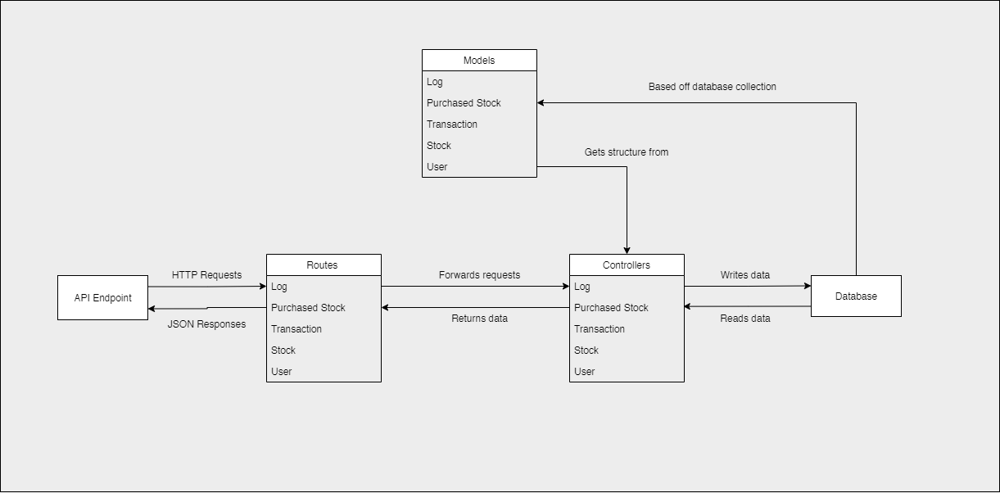
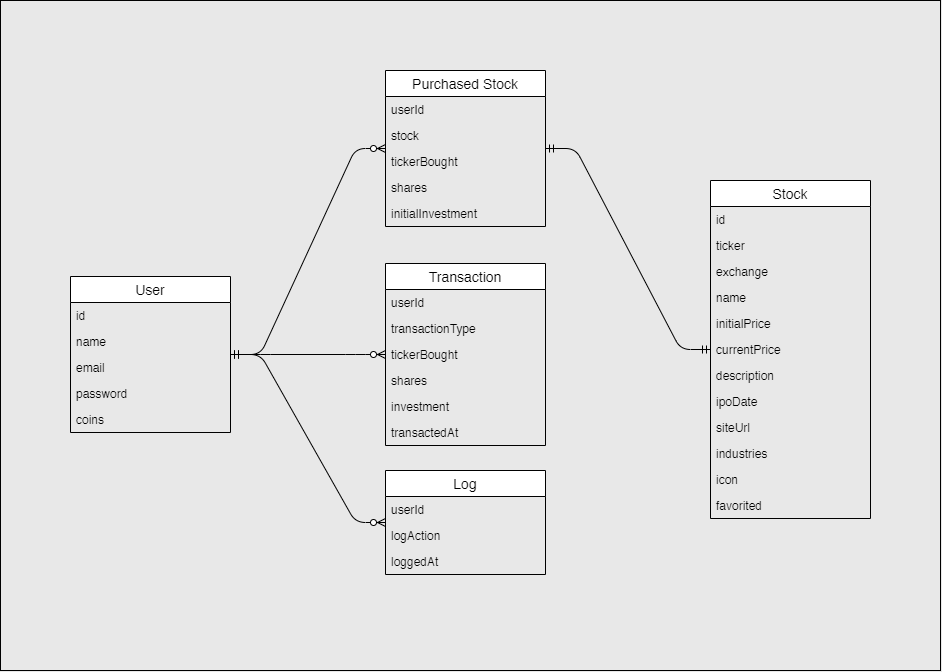

# Data Flow Diagram
### StockPulse — Trading Platform Simulation
**Phase 2: Requirement Analysis**

---

## Overview

This document describes how data flows through the StockPulse system — from the user's browser through the React frontend, Express REST API, WebSocket server, and MongoDB Atlas database.

---

## System Architecture Reference


*The above diagram shows the complete system: React Frontend hosted on Vercel, Express REST API and Socket.IO WebSocket server executed by Node.JS, Mongoose ODM connecting to MongoDB Atlas Cloud Database.*

---

## Level 0 — Context Diagram (Highest Level)

```
┌─────────────────────────────────────────────────────┐
│                                                     │
│   [ User (Browser) ]                                │
│         │                                           │
│         │  HTTP Requests / WebSocket                │
│         ▼                                           │
│   [ StockPulse System ]                             │
│         │                                           │
│         │  Read/Write                               │
│         ▼                                           │
│   [ MongoDB Atlas Database ]                        │
│                                                     │
└─────────────────────────────────────────────────────┘
```

**External Entities:**
- **User** — interacts via browser (React frontend)
- **MongoDB Atlas** — external cloud database storing all persistent data

---

## Level 1 — Main Data Flows

```
                    ┌──────────────────────┐
                    │   React Frontend     │
                    │   (Vercel)           │
                    └──────────┬───────────┘
                               │
              ┌────────────────┴────────────────┐
              │  HTTP REST                      │  WebSocket
              ▼                                 ▼
   ┌──────────────────┐            ┌─────────────────────┐
   │  Express REST    │            │  Socket.IO Server   │
   │  API             │            │  (Price Ticker)     │
   └────────┬─────────┘            └──────────┬──────────┘
            │                                 │
            │  Mongoose ODM                   │  Real-time
            ▼                                 │  price updates
   ┌──────────────────┐                       │
   │  MongoDB Atlas   │◄──────────────────────┘
   │  Database        │
   └──────────────────┘
```

---

## Level 2 — Detailed Data Flows by Feature

### 2.1 User Authentication Flow

```
User fills Register/Login form
         │
         ▼
React dispatches Redux action (auth actions)
         │
         ▼
API call → POST /api/users/register OR /api/users/login
         │
         ▼
Express Route → Auth Controller
         │
         ├── [Register] Hash password → Save new User to MongoDB
         │                           → Return JWT token
         │
         └── [Login]  Verify email + password hash
                      → Return JWT token + user data
         │
         ▼
Redux stores token + user in state
         │
         ▼
Navigation shows balance + avatar (logged in state)
```

**Data involved:** `name`, `email`, `password (hashed)`, `coins (100000)`, `JWT token`

---

### 2.2 Real-Time Stock Price Flow

```
Socket.IO Server (markets.js / tickers.js)
         │
         │  Every ~2 seconds
         ▼
Randomly adjusts stock prices ±small %
         │
         ▼
Emits price update event to all connected clients
         │
         ▼
React frontend receives WebSocket message
         │
         ▼
Redux updates stock currentPrice in store
         │
         ▼
PriceChart component re-renders with new data point
CurrentPrice badge updates (green/red)
```

**Data involved:** `stockId`, `ticker`, `newPrice`, `timestamp`

---

### 2.3 Buy Stock Flow

```
User selects shares → clicks Buy
         │
         ▼
TransactionForm validates input (shares > 0, enough balance)
         │
         ▼
API call → POST /api/purchased_stocks
         │
         ▼
Express Route → Purchased Stock Controller
         │
         ├── Deduct cost from User.coins in MongoDB
         ├── Create/update PurchasedStock document
         └── Create Transaction document (type: BUY)
         └── Create Log document (action: bought X shares)
         │
         ▼
Redux updates: balance, purchased stocks, transactions, logs
         │
         ▼
UI updates: balance in nav, portfolio shows new holding
```

**Data involved:** `userId`, `ticker`, `shares`, `investment amount`, `transactionType: BUY`

---

### 2.4 Sell Stock Flow

```
User clicks Sell on investment page
         │
         ▼
API call → DELETE /api/purchased_stocks/:id
         │
         ▼
Express Route → Purchased Stock Controller
         │
         ├── Calculate sell value (shares × currentPrice)
         ├── Add value back to User.coins in MongoDB
         ├── Delete PurchasedStock document
         └── Create Transaction document (type: SELL)
         └── Create Log document (action: sold X shares)
         │
         ▼
Redux updates: balance increases, stock removed from portfolio
         │
         ▼
UI updates: balance in nav, investment removed from list
```

**Data involved:** `userId`, `purchasedStockId`, `sellValue`, `transactionType: SELL`

---

## Level 3 — Database Collections Data Flow

### Backend MVC Reference



*The above diagram shows the MVC pattern: API Endpoint → Routes → Controllers → Database, with Models defining structure from MongoDB collections.*

### Database Schema Reference



*The above diagram shows all 5 collections: User, Stock, PurchasedStock, Transaction, Log — with their fields and relationships.*

### Collection Data Flow Summary

| Collection | Written by | Read by | Trigger |
|------------|-----------|---------|---------|
| `users` | Register, Update Account | Login, Balance check | Auth actions |
| `stocks` | Seed script, Socket.IO | Markets page, Stock details | App start / WebSocket |
| `purchased_stocks` | Buy action | Portfolio page | Trade action |
| `transactions` | Buy / Sell actions | Dashboard → Transactions tab | Trade action |
| `logs` | All user actions | Dashboard → Logs tab | Any user action |

---

## Data Store Summary

| Data Store | Technology | Location |
|------------|-----------|----------|
| User sessions (JWT) | Browser localStorage | Client side |
| Application state | Redux store | Client side (in-memory) |
| Persistent data | MongoDB Atlas | Cloud (remote) |
| Real-time prices | Socket.IO events | In-memory (server) |

---

*Document prepared for: College Project Submission*
*Project: StockPulse — Trading Platform Simulation*
*Author: Md Arsalan*
