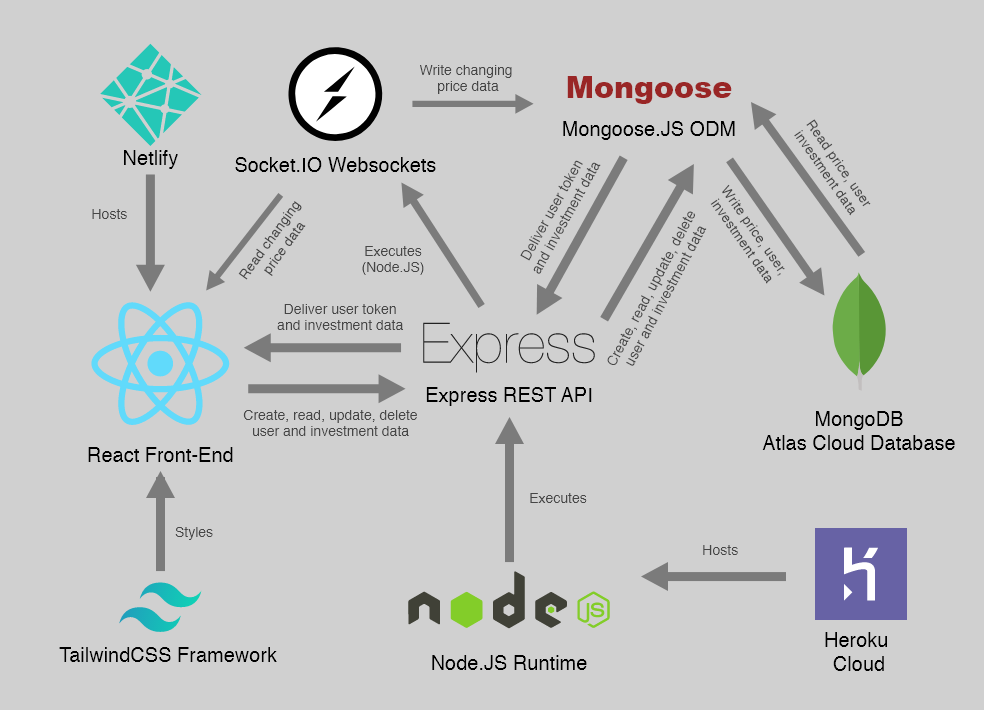

# Technology Stack
### StockPulse — Trading Platform Simulation
**Phase 2: Requirement Analysis**

---

## Overview

StockPulse is built on the **MERN stack** — a popular full-stack JavaScript technology combination — enhanced with Socket.IO for real-time capabilities and TailwindCSS for utility-first styling.

---

## Technology Stack Diagram

*The system diagram shows how all technologies interact: React (frontend) ↔ Express REST API + Socket.IO (backend) ↔ Mongoose ODM ↔ MongoDB Atlas (database)*

---

## 1. Frontend Technologies

### React 17
- **Type:** UI Library
- **Purpose:** Building the entire frontend as a component-based single-page application
- **Why chosen:** Industry standard for SPAs, large ecosystem, component reusability
- **Version:** 17.0.2

### Redux + Redux Thunk
- **Type:** State Management
- **Purpose:** Managing global application state (user auth, stocks, portfolio, transactions, logs)
- **Why chosen:** Predictable state container, excellent for complex data flows in trading apps
- **Middleware:** Redux Thunk for async API calls

### React Router DOM v5
- **Type:** Client-side Routing
- **Purpose:** Handling navigation between pages (Home, Markets, Guide, Dashboard, etc.)
- **Why chosen:** Standard routing solution for React SPAs

### TailwindCSS (v2 PostCSS7 compat)
- **Type:** CSS Framework
- **Purpose:** Utility-first styling for rapid UI development
- **Why chosen:** Highly customisable, no unused CSS, works well with component architecture
- **Note:** Using `@tailwindcss/postcss7-compat` for compatibility with React Scripts v4

### CRACO (Create React App Configuration Override)
- **Type:** Build Tool Override
- **Purpose:** Customising Create React App configuration (adding PostCSS plugins for Tailwind)
- **Why chosen:** Allows config customisation without ejecting from CRA

### Chart.JS v3
- **Type:** Data Visualisation
- **Purpose:** Rendering live price charts for each stock and portfolio insights
- **Why chosen:** Lightweight, well-documented, easy to integrate with React via canvas

### Socket.IO Client v4
- **Type:** WebSocket Client
- **Purpose:** Connecting to the backend Socket.IO server to receive real-time price updates
- **Why chosen:** Abstraction over raw WebSockets with automatic reconnection

### Axios
- **Type:** HTTP Client
- **Purpose:** Making all REST API calls from React to the Express backend
- **Why chosen:** Promise-based, simple interceptors, consistent API

### JWT Decode
- **Type:** Utility
- **Purpose:** Decoding JWT tokens on the frontend to read user data
- **Why chosen:** Lightweight, no dependencies

---

## 2. Backend Technologies

### Node.JS
- **Type:** Runtime Environment
- **Purpose:** Executing JavaScript on the server side
- **Why chosen:** Same language as frontend (JavaScript), non-blocking I/O ideal for real-time apps
- **Note:** Requires `--openssl-legacy-provider` flag for compatibility

### Express.JS
- **Type:** Web Framework
- **Purpose:** Building the REST API with routes, middleware, and controllers
- **Why chosen:** Minimal, flexible, widely used — the standard Node.JS web framework

### Mongoose.JS
- **Type:** MongoDB ODM (Object Document Mapper)
- **Purpose:** Defining schemas, models, and handling all MongoDB interactions
- **Why chosen:** Elegant schema definition, built-in validation, query helpers

### Socket.IO Server v4
- **Type:** WebSocket Server
- **Purpose:** Broadcasting real-time stock price updates to all connected clients
- **Why chosen:** Cross-browser compatible, handles reconnections, rooms/namespaces support

### JSON Web Token (JWT)
- **Type:** Authentication
- **Purpose:** Generating and verifying authentication tokens for protected routes
- **Why chosen:** Stateless authentication — no server-side session storage needed

### bcryptjs
- **Type:** Security / Password Hashing
- **Purpose:** Hashing user passwords before storing in database
- **Why chosen:** Industry standard for secure password storage

### dotenv
- **Type:** Configuration
- **Purpose:** Loading environment variables from `.env` files
- **Why chosen:** Keeps secrets out of source code

---

## 3. Database

### MongoDB Atlas
- **Type:** Cloud NoSQL Database
- **Purpose:** Storing all persistent data: users, stocks, transactions, purchased stocks, logs
- **Why chosen:** Flexible document model (JSON-like), free cloud tier, pairs perfectly with Mongoose
- **Hosting:** MongoDB Atlas free cluster (M0 tier)
- **Collections:** users, stocks, purchased_stocks, transactions, logs

---

## 4. Testing Technologies

### React Testing Library
- **Type:** Frontend Unit Testing
- **Purpose:** Testing React components in isolation
- **Tests written for:** Landing page, Markets page, Navigation component

### Cypress
- **Type:** End-to-End Testing
- **Purpose:** Testing complete user flows in a real browser environment
- **Test written for:** Full investment flow (browse stock → buy → verify portfolio)

---

## 5. Deployment

### Vercel
- **Type:** Frontend Hosting / CDN
- **Purpose:** Deploying and hosting the React frontend
- **Why chosen:** Free tier, automatic GitHub deployments, global CDN, perfect for React/CRA
- **Live URL:** https://stock-pulse-olive.vercel.app/

### MongoDB Atlas
- **Type:** Database Hosting
- **Purpose:** Cloud hosting for MongoDB
- **Tier:** Free M0 cluster

---

## 6. Development Tools

| Tool | Purpose |
|------|---------|
| VS Code | Primary code editor |
| Git + GitHub | Version control and repository hosting |
| Postman | API endpoint testing during development |
| PowerShell | File management and git commands |
| npm | Package management for both frontend and backend |

---

## 7. Technology Stack Summary Table

| Layer | Technology | Version |
|-------|-----------|---------|
| Frontend Framework | React | 17.0.2 |
| State Management | Redux + Redux Thunk | 4.1.0 / 2.3.0 |
| Routing | React Router DOM | 5.2.0 |
| Styling | TailwindCSS | 2.x (PostCSS7) |
| Charts | Chart.JS | 3.4.0 |
| Real-time | Socket.IO Client | 4.1.2 |
| HTTP Client | Axios | 0.21.1 |
| Build Tool | CRACO | 6.1.2 |
| Backend Runtime | Node.JS | LTS |
| Backend Framework | Express.JS | 4.x |
| ODM | Mongoose.JS | 5.x |
| WebSocket Server | Socket.IO | 4.x |
| Authentication | JWT | — |
| Password Hashing | bcryptjs | — |
| Database | MongoDB Atlas | M0 Free |
| Frontend Hosting | Vercel | — |
| Unit Testing | React Testing Library | 12.0.0 |
| E2E Testing | Cypress | 8.7.0 |

---

*Document prepared for: College Project Submission*
*Project: StockPulse — Trading Platform Simulation*
*Author: Md Arsalan*
