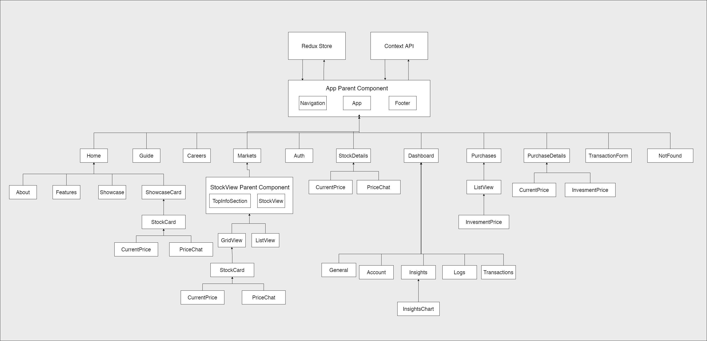

# Solution Architecture
### StockPulse — Trading Platform Simulation
**Phase 3: Project Design Phase**

---

## 1. Architecture Overview

StockPulse follows a **three-tier client-server architecture** with an additional real-time layer powered by WebSockets. The system is designed for scalability, separation of concerns, and clear data flow between layers.

---

## 2. System Architecture Diagram


*The above diagram illustrates the complete system: React Frontend (Vercel) communicates with the Express REST API and Socket.IO WebSocket server (Node.JS runtime), which in turn interacts with MongoDB Atlas via Mongoose ODM.*

---

## 3. Architectural Layers

### Layer 1: Presentation (Frontend)
- **Technology:** React 17, Redux, TailwindCSS, Chart.JS
- **Hosting:** Vercel (global CDN)
- **Responsibilities:**
  - Rendering all UI components
  - Managing application state via Redux store
  - Making HTTP requests via Axios
  - Maintaining WebSocket connection via Socket.IO client
  - Client-side routing via React Router DOM

### Layer 2: Application (Backend)
- **Technology:** Node.JS, Express.JS, Socket.IO
- **Responsibilities:**
  - Handling all REST API requests
  - Authenticating users via JWT middleware
  - Processing business logic (buy/sell, balance updates)
  - Broadcasting real-time price updates via WebSockets

### Layer 3: Data (Database)
- **Technology:** MongoDB Atlas, Mongoose ODM
- **Responsibilities:**
  - Persisting all user, stock, transaction, and log data
  - Providing schema validation via Mongoose models
  - Serving as the single source of truth for all application data

---

## 4. Backend MVC Architecture


*The above diagram shows the MVC pattern within the Express backend: API Endpoints receive HTTP requests → Routes forward to appropriate Controllers → Controllers use Models (which derive structure from MongoDB collections) to read/write data → Returns JSON responses.*

### Backend Structure
```
backend/
├── index.js              ← Server entry point, Express + Socket.IO setup
├── middleware/
│   └── auth.js           ← JWT verification middleware
├── routes/               ← URL path definitions
│   ├── users.js
│   ├── stocks.js
│   ├── purchased_stocks.js
│   ├── transactions.js
│   └── action_logs.js
├── controllers/          ← Business logic
│   ├── users.js
│   ├── stocks.js
│   ├── purchased_stocks.js
│   ├── transactions.js
│   └── action_logs.js
├── models/               ← Mongoose schemas
│   ├── user.js
│   ├── stock.js
│   ├── purchased_stock.js
│   ├── transaction.js
│   └── action_log.js
├── web_sockets/          ← Socket.IO real-time logic
│   ├── markets.js        ← Price broadcast manager
│   └── tickers.js        ← Price update ticker
└── seed.js               ← Database seeding script (50 stocks)
```

---

## 5. Database Schema Architecture


*The above diagram shows the entity relationships between all 5 MongoDB collections: User (1) → (*) PurchasedStock (*) → (1) Stock, User (1) → (*) Transaction (*) → (1) Stock, User (1) → (*) Log*

### Collections & Relationships

| Collection | Key Fields | Relationship |
|------------|-----------|-------------|
| `users` | name, email, password, coins | Parent of purchased_stocks, transactions, logs |
| `stocks` | ticker, name, exchange, currentPrice, initialPrice | Referenced by purchased_stocks, transactions |
| `purchased_stocks` | userId, stock, shares, initialInvestment | Belongs to user, references stock |
| `transactions` | userId, type, ticker, shares, investment, date | Belongs to user |
| `logs` | userId, logAction, loggedAt | Belongs to user |

---

## 6. Frontend Component Architecture



*The above diagram shows the full React component hierarchy: Redux Store and Context API connect to the App Parent Component (Navigation + App + Footer), which routes to all page components and their children.*

### Key Component Groups

**Global:**
- `Navigation` — persistent header with balance badge and avatar dropdown
- `Footer` — persistent footer with links

**Home Page:**
- `Landing` → `Features` → `Showcase` (with `ShowcaseCard`) → `About`

**Markets:**
- `StockView` (parent) → `TopInfoSection` + `GridView`/`ListView`
- Each view contains `StockCard` → `CurrentPrice` + `PriceChart`

**Stock Detail:**
- `StockDetails` → `CurrentPrice` + `PriceChart` + `TransactionForm`

**Portfolio:**
- `PurchasedStocks` → `PurchaseOverview` + `PurchaseListView`
- `PurchasedStockDetails` → `CurrentPrice` + `InvestmentPrice`

**Dashboard:**
- `Dashboard` → `General` / `Account` / `Insights` / `Transactions` / `Logs`

---

## 7. Real-Time Architecture

```
┌─────────────────────────────────────────────────────┐
│                Socket.IO Architecture               │
│                                                     │
│  Server (tickers.js)                                │
│  ┌────────────────────────────────────┐             │
│  │  setInterval(every ~2s)            │             │
│  │  → Randomly adjust stock prices   │             │
│  │  → Emit 'price_update' event       │             │
│  │    { stockId, ticker, newPrice }   │             │
│  └────────────────────────────────────┘             │
│                    │ WebSocket                      │
│                    ▼                                │
│  All connected React clients receive update         │
│  ┌────────────────────────────────────┐             │
│  │  socket.on('price_update', msg)    │             │
│  │  → Redux dispatches price change  │             │
│  │  → PriceChart adds new data point │             │
│  │  → CurrentPrice badge re-renders  │             │
│  └────────────────────────────────────┘             │
└─────────────────────────────────────────────────────┘
```

---

## 8. Authentication Architecture

```
Register/Login
     │
     ▼
POST /api/users/register OR /api/users/login
     │
     ▼
Controller validates credentials
bcrypt compares password hash
     │
     ▼
JWT token generated (signed with JWT_SECRET)
     │
     ▼
Token stored in Redux state + localStorage
     │
     ▼
All subsequent requests include:
Authorization: Bearer <token>
     │
     ▼
auth.js middleware verifies token on protected routes
     │
     ├── Valid → req.userId set → controller runs
     └── Invalid → 401 Unauthorized response
```

---

## 9. Deployment Architecture

```
Developer → git push → GitHub (main branch)
                              │
                              │ Auto-deploy trigger
                              ▼
                         Vercel CI/CD
                              │
                    NODE_OPTIONS=--openssl-legacy-provider
                    craco build
                              │
                              ▼
                    /build output deployed
                    to Vercel global CDN
                              │
                              ▼
              https://stock-pulse-olive.vercel.app/
```

---

*Document prepared for: College Project Submission*
*Project: StockPulse — Trading Platform Simulation*
*Author: Md Arsalan*
